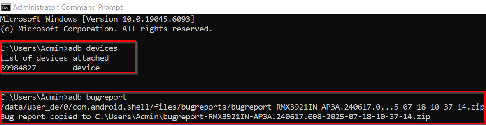
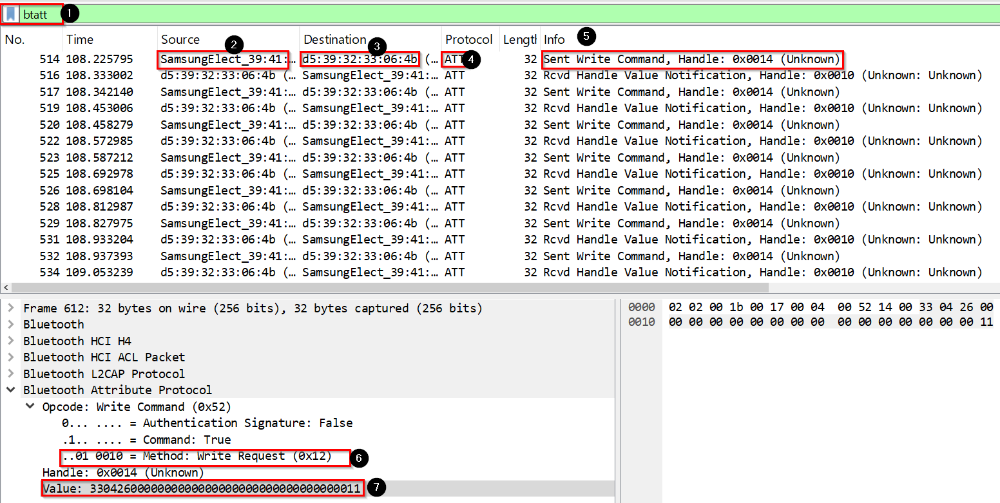

# 💡 Govee Smart Bulb Controller

A simple project to control **Govee Smart Bulbs** using Python over Bluetooth Low Energy (BLE). This project is intended for learning and experimentation with smart home device automation.

---

## 🚀 Features

- Power on/off the Govee bulb
- Change color using RGB values
- BLE-based communication (no cloud API required)
- CLI or script-based control

---

## 🔧 Requirements

- Python 3.7+
- A compatible BLE adapter (e.g., built-in BLE on Raspberry Pi)
- Govee BLE-capable smart bulb (tested on model H6001 / H6085 / etc.)
- To work with Smart Bulb create our own python virtual environment
```bash
  python3 -m venv smart_bulb
  source smart_bulb/bin/activate
```

## 🛠 Python Packages/Libraries

  Install dependencies using:

  ```bash
    pip install dbus-python : For IPC Communication between host and controller
    pip install bleak : For BLE Device Authentication Mechanism
```
## 📲 Capturing Govee Bulb BLE Snoop Logs via Android Phone
To analyze communication between the Govee mobile app and the bulb:

### Step-by-Step Guide
1. Enable Developer Options on Android

    -   Go to Settings > About Phone
    -   Tap Build Number 5 times
2. Enable HCI Snoop Logging
    -   Go to Settings > Developer Options
    -   Enable Bluetooth HCI Snoop Logs
3. Enable USB Debugging to transfer logs from Mobile to System.
4. Restart the phone to confirm changes are applied.
5. Download Govee Home App from Playstore to Control Bulb
6. Connect Bulb to application and control via BLE and perform some operations on it.
For ex. Change colors, increase/decrease brightness etc.
7. Now, Connect mobile phone to system and extract logs using adb.

    ```bash
    adb bugreport
    Note:- adb should be installed on your system.
    ```

8. Analyze the logs in wireshark


##  Setup Instructions
1. Clone the Repository
```bash
git clone https://github.com/<your-username>/Govee_SmartBulb.git
cd Govee_SmartBulb
```
2. Install Dependencies

3. Run the script
```bash
python3 connection_with_multicolour_govee.py
```
## 👨‍💻 Author
Kishor Rankhamb

Feel free to contribute, fork or ask queries!

[](https://www.linkedin.com/in/kishor-jeevan-rankhamb-b657a5138/)
